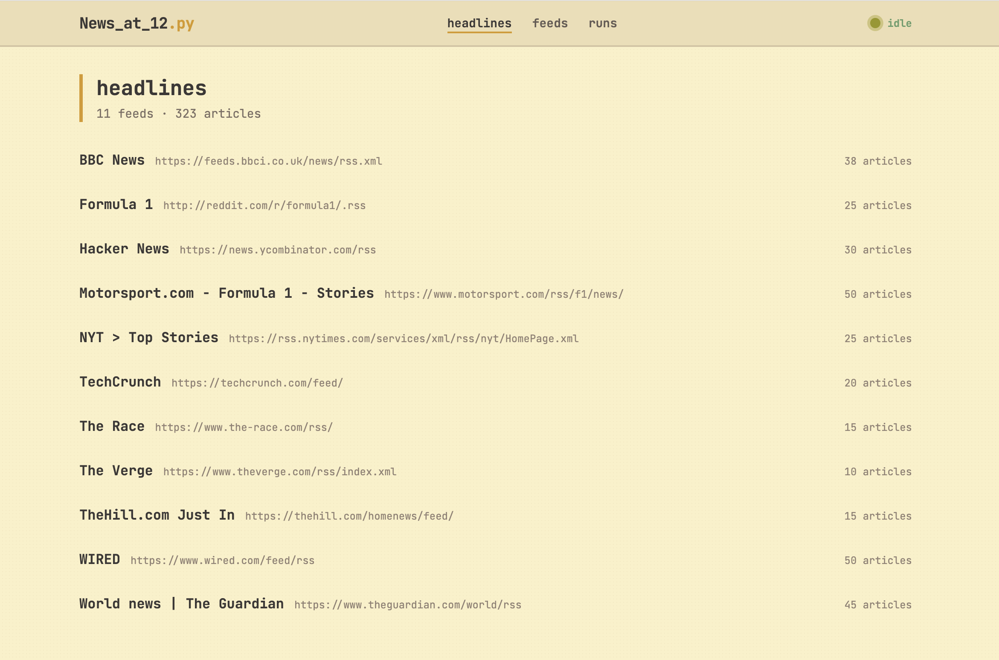

# News_at_12

A self-hosted RSS headline aggregator built with Python, Flask, and SQLite.
Fetches feeds concurrently, deduplicates articles, and serves them through
a Jinja2 frontend and a versioned REST API with Swagger documentation.

<!--
SCREENSHOTS: To add screenshots or GIFs to this README, do the following:

1. Take your screenshots and save them as PNG files (e.g. headlines.png, feeds.png, runs.png, swagger.png)
2. Create a folder in the repo: docs/screenshots/
3. Copy your image files there
4. Replace each placeholder block below with the correct path, like so:

   

For GIFs, record a short screen capture (Kap on macOS is good for this),
export as GIF, and use the same process. Recommended: one GIF showing
a run being triggered and the status indicator updating.
-->

<!-- PLACEHOLDER: Add a screenshot of the headlines page here -->

---

## Features

- **Concurrent feed fetching** — fetches multiple RSS feeds in parallel using `asyncio` and `ThreadPoolExecutor`
- **SQLite storage** — persistent deduplication tracking when headlines were first and last seen, and how many times they have appeared
- **Flask web frontend** — Jinja2 templates with a Gruvbox light theme served locally
- **REST API** — versioned endpoints under `/api/v1/` with interactive Swagger UI via Flasgger
- **TOML configuration** — feeds and settings managed in a single `config.toml` file
- **Run history** — every fetch is logged to the database with timing and article statistics
- **JSON export** — clean snapshot written after every run, structured for LLM ingestion
- **Rotating logs** — separate info and error log files that never grow unbounded

---

## Documentation

- **Sphinx technical docs** — [https://code-locke.github.io/news_project/](https://code-locke.github.io/news_project/)
- **Swagger API UI** — available at `/apidocs` when the application is running

---

## Requirements

- Python 3.11+
- pip packages: `flask`, `flasgger`, `feedparser`

---

## Setup

```bash
# Clone the repository
git clone https://github.com/Code-Locke/news_project.git
cd news_project

# Create and activate a virtual environment
python3 -m venv venv
source venv/bin/activate  # Windows: venv\Scripts\activate

# Install dependencies
pip install flask flasgger feedparser
```

---

## Configuration

All settings live in `config.toml` in the project root. Create it if it does not exist:

```toml
[settings]
db_file           = "headlines.db"
json_output       = "headlines.json"
log_file          = "news_at_12.log"
error_log_file    = "news_errors.log"
log_max_bytes     = 1000000
log_backup_count  = 3
max_workers       = 10
summary_limit     = 300

[[feeds]]
url     = "https://feeds.bbci.co.uk/news/rss.xml"
name    = "BBC News"
enabled = true

[[feeds]]
url     = "https://rss.nytimes.com/services/xml/rss/nyt/HomePage.xml"
name    = "NYT"
enabled = true
```

Add one `[[feeds]]` block per RSS source. Set `enabled = false` to temporarily disable a feed without removing it.

---

## Running the app

```bash
python app.py
```

Then open `http://localhost:5000` in your browser.

<!-- PLACEHOLDER: Add a GIF of a run being triggered and the status indicator updating here -->

---

## Pages

### Headlines (`/`)

All fetched articles grouped by feed, displayed as collapsible sections.
New articles are badged NEW. Repeat articles show a seen count.

<!-- PLACEHOLDER: Add a screenshot of the headlines page here -->

### Feeds (`/feeds`)

All configured RSS sources with article counts and last-fetched timestamps.

<!-- PLACEHOLDER: Add a screenshot of the feeds page here -->

### Runs (`/runs`)

Full run history showing fetch time, feed counts, and new article counts.
The "run now" button triggers a fresh fetch and polls for completion.

<!-- PLACEHOLDER: Add a screenshot of the runs page here -->

---

## REST API

The API is versioned under `/api/v1/`. All responses follow a consistent envelope:

```json
{
  "data": {},
  "meta": {}
}
```

| Method | Endpoint | Description |
|--------|----------|-------------|
| GET | `/api/v1/headlines` | All headlines, paginated (`?limit=` and `?offset=`) |
| GET | `/api/v1/headlines/<id>` | Single headline by ID |
| GET | `/api/v1/feeds` | All feeds |
| GET | `/api/v1/feeds/<id>` | Single feed by ID |
| GET | `/api/v1/runs` | Run history (last 50) |
| GET | `/api/v1/status` | Current aggregator status |
| POST | `/api/v1/run` | Trigger an aggregator run |

The interactive Swagger UI is available at `/apidocs` when the app is running.

<!-- PLACEHOLDER: Add a screenshot of the Swagger UI here -->

---

## Database

SQLite database with three tables:

**`feeds`** — one row per RSS source
```sql
id, url, title, site_link, first_seen, last_fetched
```

**`headlines`** — one row per unique article, keyed by SHA-256 hash of URL
```sql
id, url_hash, feed_id, title, url, published, summary,
first_seen, last_seen, seen_count
```

**`runs`** — one row per aggregator run
```sql
id, started_at, finished_at, elapsed_sec, feeds_fetched,
feeds_failed, articles_total, articles_new
```

### Example queries

```bash
sqlite3 headlines.db
```

```sql
-- Most frequently recurring headlines
SELECT title, seen_count, first_seen
FROM headlines
ORDER BY seen_count DESC
LIMIT 20;

-- Everything new in the last 24 hours
SELECT title, url
FROM headlines
WHERE first_seen >= datetime('now', '-1 day');

-- All headlines from a specific source
SELECT h.title, h.first_seen
FROM headlines h
JOIN feeds f ON f.id = h.feed_id
WHERE f.title = 'BBC News';

-- Run history with statistics
SELECT started_at, elapsed_sec, articles_new, feeds_failed
FROM runs
ORDER BY started_at DESC
LIMIT 10;
```

---

## Design decisions

- **Fetch/store separation** — `fetch_feed()` does pure network calls (safe to parallelise), `store_feed()` does pure DB writes (sequential for SQLite thread safety)
- **Batch commits** — one transaction per feed instead of per-row for significantly fewer disk flushes
- **URL hashing** — SHA-256 of article URLs provides instant deduplication without full string comparisons
- **Jinja2 frontend alongside API** — the Flask templates query SQLite directly in one round trip; the API exists as a documented interface without replacing the frontend

---

## Logging

Two log files are created and rotated automatically:

- `news_at_12.log` — all INFO and above messages
- `news_errors.log` — ERROR messages only

Logs rotate at 1 MB and keep 3 backup copies by default. Both values are configurable in `config.toml`.

---

## Deployment

Tested on a self-hosted Linux laptop. Also suitable for:

- **Raspberry Pi 4/5** — works with default settings, can run 24/7 headless
- **Raspberry Pi Zero** — reduce `max_workers` to 2 and limit to 10-15 feeds

---

## Troubleshooting

**No feeds appear after a run**
- Check that `config.toml` exists and contains at least one `[[feeds]]` block with `enabled = true`

**Feeds timing out**
- Some feeds are slow or unreliable — check `news_errors.log` for details

**High memory usage**
- Reduce `max_workers` and/or `summary_limit` in `config.toml`

**Swagger UI not loading**
- Make sure `flasgger` is installed: `pip install flasgger`
- The UI is only available while `app.py` is running

---

## Future enhancements

- [ ] Email delivery of daily digests
- [ ] LLM-generated summaries across feeds
- [ ] Full article extraction
- [ ] Keyword watchlists and alerting
- [ ] Query CLI for database exploration
- [ ] Docker containerisation

---

## Stack

- Python 3.12
- Flask, Flasgger, Jinja2
- SQLite via `sqlite3`
- feedparser
- Tailwind CSS (CDN) with Gruvbox light theme
- Sphinx + Furo for technical documentation
- GitHub Actions for automated docs deployment

---

## License

MIT License — see LICENSE file for details.

## Contact

[github.com/Code-Locke](https://github.com/Code-Locke)